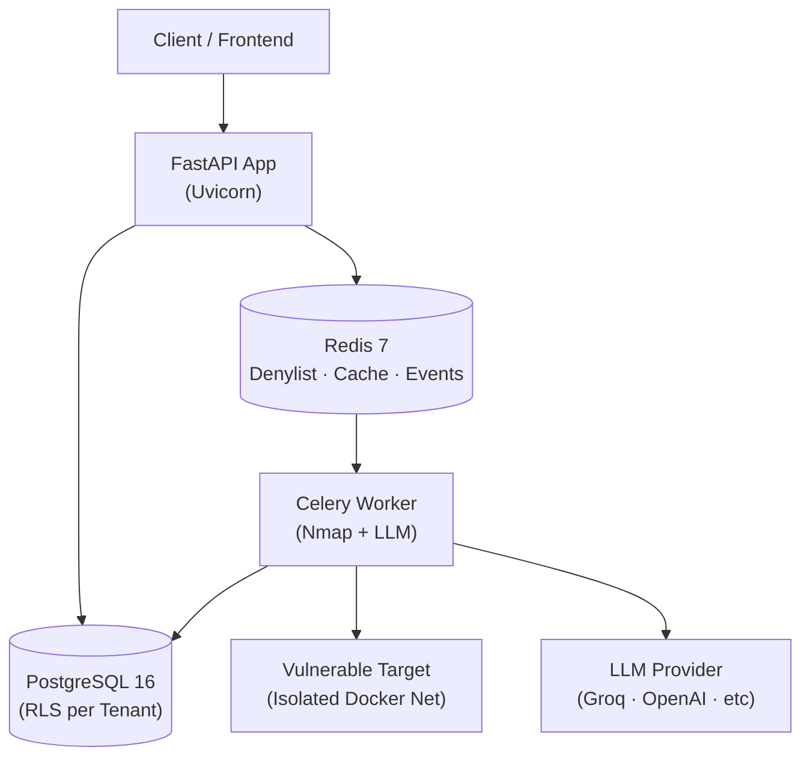
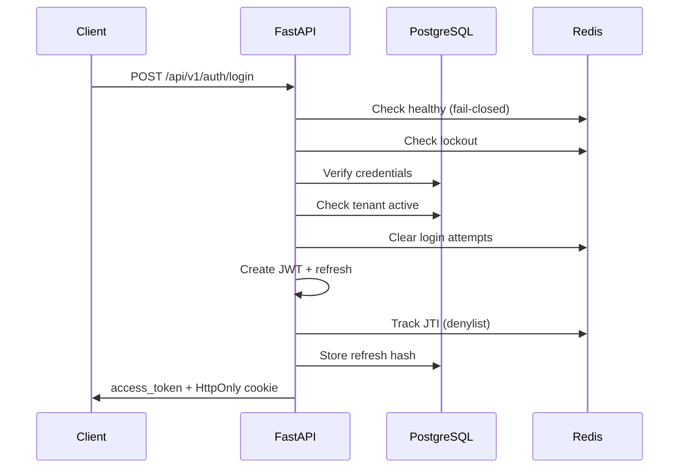
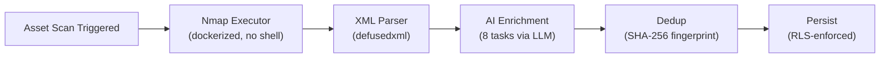

# SOC360-PyMEs — SOC como Servicio para Pequeñas y Medianas Empresas

[🇺🇸 English](README.md)


---

## Por qué SOC360-PyMEs

Las pequeñas y medianas empresas (PyMEs) enfrentan las mismas amenazas cibernéticas que las grandes corporaciones, pero rara vez cuentan con el presupuesto para construir o mantener un Centro de Operaciones de Seguridad (SOC) 24/7. **SOC360-PyMEs** elimina esa brecha al entregar un backend SaaS multi-tenant que proporciona operaciones de seguridad de nivel empresarial a una fracción del costo.

- **Problema**: Las PyMEs carecen de equipos de seguridad dedicados, gestión de vulnerabilidades y detección de amenazas en tiempo real.
- **Solución**: Una plataforma SOC-as-a-Service con descubrimiento automatizado de activos, análisis de vulnerabilidades potenciado por IA, aislamiento por tenant y procesamiento escalable de eventos.

---

## Estado Actual

| Fase | Estado | Descripción |
|------|--------|-------------|
| **F0** | ✅ Completado | Arquitectura y Modelo de Datos — 23 ADRs, 13 tablas DB, modelo de seguridad |
| **F1** | ✅ Completado | Base del Backend — Auth, tenants, usuarios, RLS, eventos, LLM — 500+ tests pasando |
| **F2** | 🔄 En Progreso | Agente de Vulnerabilidades — Executor Nmap, agente LangGraph, CRUD asset/vuln, dashboard, reportes PDF |
| **F3** | 📋 Planificado | Tiempo Real — WebSockets, ingestión de logs, detección de anomalías |
| **F4** | 📋 Planificado | Frontend — React 18 + TypeScript + Vite (MVP Junio 2026) |
| **F5** | 📋 Planificado | Agentes Extra — Cumplimiento, Inteligencia |
| **F6** | 📋 Planificado | Avanzado — Email, reportes PDF, Redis TLS |
| **F7** | 📋 Planificado | QA + Prod — E2E tests, CI/CD, deploy |

---

## Features Principales

| Feature | Descripción |
|---------|-------------|
| **Autenticación y Seguridad** | JWT access (15min) + rotación de refresh (7d, cookie HttpOnly). Denylist JTI vía Redis. Bloqueo de login (10 intentos / 15min). Rate limiting. Protección CSRF. Security headers. Sanitización PII. |
| **Multi-Tenant (RLS)** | Row-Level Security vía PostgreSQL `SET LOCAL`. Contexto de tenant por transacción. 4 planes: Free (10 assets), Starter (25), Pro (100), Enterprise (500). |
| **RBAC** | Roles jerárquicos: viewer < analyst/ingestor < admin < superadmin. CHECK constraints refuerzan reglas de tenant. Autoprotección evita escalada de privilegios. |
| **Event Bus** | Redis Streams con eventos tipados Pydantic, consumer groups, XACK, Dead Letter Queue, auto-reconexión y monitoreo de lag. |
| **Abstracción LLM** | Provider Protocol con 8 proveedores. Groq (llama-3.3-70b) por defecto. Caché singleton. `llm_safe_complete()` nunca lanza excepciones. Redacción de credenciales. |

---

## Arquitectura de Alto Nivel



La plataforma sigue un patrón de monolito modular. FastAPI gestiona el tráfico HTTP, PostgreSQL impone aislamiento de tenant a nivel de fila, y Redis actúa como sistema nervioso central para denylist de sesiones, caché y streaming de eventos asíncronos. Los workers de Celery descargan tareas pesadas como escaneos Nmap y enriquecimiento LLM en redes Docker aisladas.

---

## Stack Tecnológico

| Tecnología | Versión |
|------------|---------|
| Python | 3.12+ |
| FastAPI | 0.115.6 |
| SQLAlchemy | 2.0.36 |
| asyncpg | 0.30.0 |
| PostgreSQL | 16 (Alpine) |
| Redis | 7 (Alpine) |
| Alembic | 1.14.0 |
| Celery | 5.4.0 |
| Pydantic | 2.10.4 |
| python-jose | 3.3.0 |
| passlib[bcrypt] | 1.7.4 |
| structlog | 24.4.0 |
| pytest | 8.3.4 |
| pytest-asyncio | 0.24.0 |
| ruff | 0.8.4 |
| mypy | 1.13.0 |
| httpx | 0.27.2 |
| fakeredis | 2.34.1 |
| Docker Compose | — |
| Groq (llama-3.3-70b) | LLM default |

---

## Estructura del Proyecto

```
soc360-pymes/
├── app/
│   ├── main.py                 # Entrypoint FastAPI, lifespan, routers
│   ├── dependencies.py         # Deps de FastAPI (get_db, get_current_user)
│   ├── event_bus.py            # EventBus Redis Streams + DLQ
│   ├── event_schemas.py        # Schemas Pydantic de eventos
│   ├── core/                   # Capa compartida
│   │   ├── config.py           # pydantic-settings
│   │   ├── database.py         # Engine async SQLAlchemy, helper RLS
│   │   ├── security.py         # JWT, bcrypt, denylist, JTI, roles
│   │   ├── redis.py            # Pool Redis + health check
│   │   ├── middleware.py       # SecurityHeaders + redirect HTTPS
│   │   ├── exceptions.py       # Jerarquía de errores
│   │   ├── logging.py          # structlog + redacción
│   │   ├── llm.py              # Abstracción LLM multi-proveedor
│   │   ├── contracts.py        # Contratos TypedDict
│   │   ├── pii.py              # Sanitización PII
│   │   └── types.py            # Tipos custom
│   └── modules/                # Módulos de dominio
│       ├── auth/               # ✅ F1 — 672 loc
│       ├── tenants/            # ✅ F1 — 510 loc
│       ├── users/              # ✅ F1 — 556 loc
│       ├── assets/             # 🔲 F2 scaffold
│       ├── scans/              # 🔲 F2 scaffold
│       ├── vulnerabilities/    # 🔲 F2 scaffold
│       ├── dashboard/          # 🔲 F2 scaffold
│       ├── alerts/             # 📋 Planificado
│       ├── anomalies/          # 📋 Planificado
│       └── ingest/             # 📋 Planificado
├── tests/                      # 10,900+ líneas
│   ├── conftest.py             # Fixtures compartidos
│   ├── unit/                   # Fakeredis + mocks
│   ├── integration/            # DB real + Alembic
│   ├── api/                    # httpx AsyncClient
│   └── modules/                # Tests por módulo
├── migrations/                 # 3 migraciones Alembic
├── docker/                     # Volúmenes Docker
├── scripts/
│   └── seed_db.py              # Seed idempotente
├── docs/
│   └── llm-abstraction.md      # Docs de capa LLM
├── docker-compose.yml
├── pytest.ini
├── requirements.txt
├── requirements-dev.txt
├── .env.example
└── AGENTS.md
```

> **Nota**: Los módulos Assets, Scans, Vulnerabilities, Dashboard y Agents son actualmente solo esqueletos (`__init__.py`) y se implementarán en F2.

---

## Quickstart

**Requisitos previos**: Docker, Python 3.12+

```bash
# 1. Clonar
git clone https://github.com/Dani1lopez/soc360-pymes.git
cd soc360-pymes

# 2. Entorno virtual
python -m venv .venv
source .venv/bin/activate  # Windows: .venv\Scripts\activate

# 3. Instalar dependencias
pip install -r requirements-dev.txt

# 4. Configurar entorno
cp .env.example .env
# Editar .env si es necesario (Docker expone PostgreSQL en puerto 5433)

# 5. Iniciar servicios (PostgreSQL 16 + Redis 7)
docker compose --profile dev up -d

# 6. Esperar a que los servicios estén saludables, luego migrar
alembic upgrade head

# 7. Seed de base de datos con datos demo
python scripts/seed_db.py

# 8. Ejecutar tests (500+ tests en 3 capas)
pytest -v

# 9. Iniciar servidor de desarrollo
uvicorn app.main:app --reload

# 10. Verificar que funciona
curl http://localhost:8000/health
```

---

## Flujo de Desarrollo

1. **Branch**: Crear branches de feature desde `develop`.
2. **Commits**: Usar [Conventional Commits](https://www.conventionalcommits.org/) (`feat:`, `fix:`, `docs:`, `test:`, `refactor:`).
3. **Pull Requests**: Abrir PRs contra `develop`. Asegurar que los tests pasen y `ruff` / `mypy` estén limpios.
4. **Reviews**: Todos los PRs requieren al menos una revisión antes del merge.

---

## Testing y Calidad

La suite de tests está organizada en tres capas:

| Capa | Alcance | Comando |
|------|---------|---------|
| **Unit** | Fakeredis + mocks, sin DB | `pytest tests/unit -v` |
| **Integration** | PostgreSQL real + migraciones Alembic | `pytest tests/integration -v` |
| **API** | Ciclo HTTP completo vía `httpx.AsyncClient` | `pytest tests/api -v` |

Comandos adicionales de calidad:

```bash
# Linting
ruff check app tests
ruff format app tests

# Type checking
mypy app

# Suite completa
pytest -v
```

Patrones clave de testing:
- Tests de concurrencia para advisory locks y sesiones paralelas.
- Tests fail-closed para escenarios sin Redis.
- Seeding determinístico con UUIDs fijos, 2 tenants y 5 usuarios.

---

## Visión General de la API

Los siguientes endpoints están disponibles en F1:

| Método | Path | Descripción |
|--------|------|-------------|
| `POST` | `/api/v1/auth/login` | Autenticar y recibir JWT + cookie refresh |
| `POST` | `/api/v1/auth/refresh` | Rotar refresh token (requiere cookie HttpOnly) |
| `POST` | `/api/v1/auth/logout` | Revocar sesión actual |
| `POST` | `/api/v1/auth/change-password` | Cambiar contraseña y revocar en cascada |
| `GET` | `/api/v1/users/me` | Obtener perfil del usuario actual |
| `POST` | `/api/v1/users/` | Crear usuario (admin+) |
| `GET` | `/api/v1/users/` | Listar usuarios (scoped a tenant) |
| `GET` | `/api/v1/users/{id}` | Obtener usuario por ID |
| `PATCH` | `/api/v1/users/{id}` | Actualizar usuario |
| `DELETE` | `/api/v1/users/{id}` | Desactivar usuario (autoprotegido) |
| `POST` | `/api/v1/tenants/` | Crear tenant (superadmin) |
| `GET` | `/api/v1/tenants/` | Listar tenants (superadmin) |
| `GET` | `/api/v1/tenants/{id}` | Obtener tenant por ID |
| `PATCH` | `/api/v1/tenants/{id}` | Actualizar tenant |
| `DELETE` | `/api/v1/tenants/{id}` | Desactivar tenant |

La documentación OpenAPI completa está disponible en `/api/docs` cuando el servidor está corriendo (deshabilitado en producción).

---

## Flujo de Autenticación



---

## Pipeline F2 (Planificado)



El pipeline F2 automatizará el descubrimiento de vulnerabilidades: un escaneo de activo dispara una ejecución containerizada de Nmap, los resultados se parsean de forma segura, se enriquecen con un LLM en 8 tareas paralelas, se deduplican vía fingerprints SHA-256, y finalmente se persisten bajo Row-Level Security.

---

## Roadmap

| Fase | Enfoque | Estado |
|------|---------|--------|
| F0 | Arquitectura y Modelo de Datos | ✅ Completado |
| F1 | Base del Backend (Auth, Tenants, Users, RLS, Events, LLM) | ✅ Completado |
| F2 | Agente de Vulnerabilidades (Nmap, LangGraph, Asset/Vuln CRUD, Dashboard, PDF) | 🔄 En Progreso |
| F3 | Tiempo Real (WebSockets, Ingestión, Anomalías) | 📋 Planificado |
| F4 | Frontend (React 18 + TS + Vite) | 📋 Planificado |
| F5 | Agentes Extra (Cumplimiento, Inteligencia) | 📋 Planificado |
| F6 | Avanzado (Email, Reportes PDF, Redis TLS) | 📋 Planificado |
| F7 | QA + Prod (E2E, CI/CD, Deploy) | 📋 Planificado |

> Los requisitos completos del producto y el plan de entregas por fase están documentados en el [PRD v1 MVP Junio](openspec/changes/prd-v1-mvp-junio/).

---

## Contribuciones

Las contribuciones son bienvenidas. Por favor abre un issue para discutir cambios significativos antes de enviar un PR. Para correcciones de bugs y mejoras pequeñas, siéntete libre de abrir un PR directamente.

- [Abrir un issue](https://github.com/Dani1lopez/soc360-pymes/issues)
- [Enviar un PR](https://github.com/Dani1lopez/soc360-pymes/pulls)

---

## Licencia

Este proyecto está licenciado bajo la **MIT License**.
