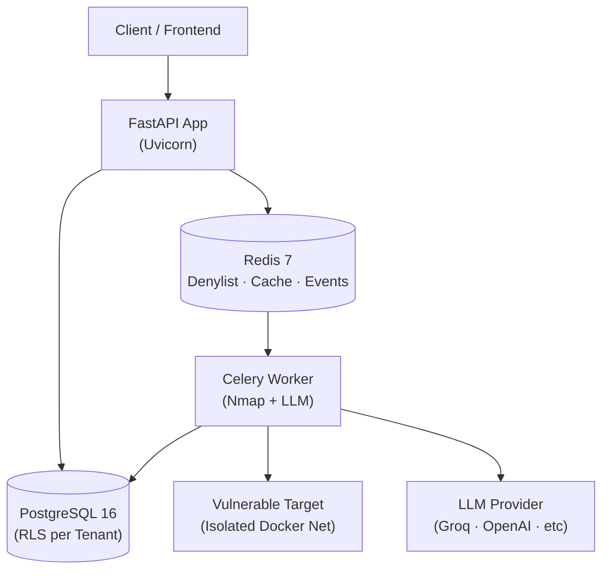
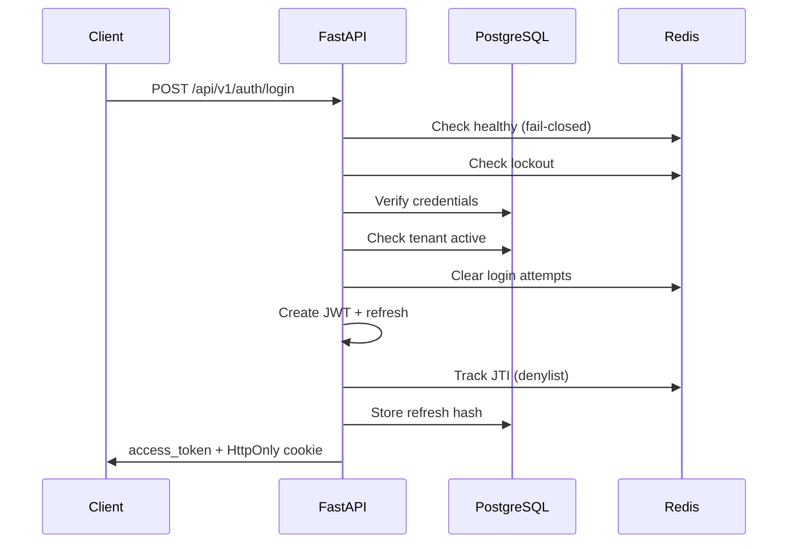
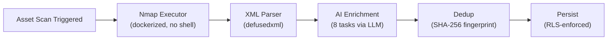

# SOC360-PyMEs — SOC as a Service for Small & Medium Businesses

[🇪🇸 Español](README.es.md)


---

## Why SOC360-PyMEs

Small and medium-sized businesses (PyMEs) face the same cyber threats as enterprises but rarely have the budget to build or maintain a 24/7 Security Operations Center (SOC). **SOC360-PyMEs** closes that gap by delivering a multi-tenant SaaS backend that provides enterprise-grade security operations at a fraction of the cost.

- **Problem**: PyMEs lack dedicated security teams, vulnerability management, and real-time threat detection.
- **Solution**: A SOC-as-a-Service platform with automated asset discovery, AI-powered vulnerability analysis, tenant isolation, and scalable event processing.

---

## Current Status

| Phase | Status | Description |
|-------|--------|-------------|
| **F0** | ✅ Complete | Architecture & Data Model — 23 ADRs, 13 DB tables, security model |
| **F1** | ✅ Complete | Backend Base — Auth, tenants, users, RLS, events, LLM — 500+ tests passing |
| **F2** | 🔄 In Progress | Vulnerability Agent — Nmap executor, LangGraph agent, asset/vuln CRUD, dashboard, PDF reports |
| **F3** | 📋 Planned | Real-time — WebSockets, log ingestion, anomaly detection |
| **F4** | 📋 Planned | Frontend — React 18 + TypeScript + Vite (MVP June 2026) |
| **F5** | 📋 Planned | Extra Agents — Compliance, Intelligence |
| **F6** | 📋 Planned | Advanced — Email, PDF reports, Redis TLS |
| **F7** | 📋 Planned | QA + Prod — E2E tests, CI/CD, deploy |

---

## Core Features

| Feature | Description |
|---------|-------------|
| **Authentication & Security** | JWT access (15min) + refresh rotation (7d, HttpOnly cookie). JTI denylist via Redis. Login lockout (10 attempts / 15min). Rate limiting. CSRF protection. Security headers. PII sanitization. |
| **Multi-Tenant (RLS)** | Row-Level Security via PostgreSQL `SET LOCAL`. Transaction-scoped tenant context. 4 plans: Free (10 assets), Starter (25), Pro (100), Enterprise (500). |
| **RBAC** | Hierarchical roles: viewer < analyst/ingestor < admin < superadmin. CHECK constraints enforce tenant rules. Self-protection prevents privilege escalation. |
| **Event Bus** | Redis Streams with typed Pydantic events, consumer groups, XACK, Dead Letter Queue, auto-reconnect, and lag monitoring. |
| **LLM Abstraction** | Provider Protocol with 8 providers. Groq (llama-3.3-70b) default. Singleton caching. `llm_safe_complete()` never raises. Credential redaction. |

---

## High-Level Architecture



The platform follows a modular monolith pattern. FastAPI handles HTTP traffic, PostgreSQL enforces tenant isolation at the row level, and Redis serves as the central nervous system for session denylisting, caching, and asynchronous event streaming. Celery workers offload heavy tasks such as Nmap scanning and LLM enrichment to isolated Docker networks.

---

## Tech Stack

| Technology | Version |
|------------|---------|
| Python | 3.12+ |
| FastAPI | 0.115.6 |
| SQLAlchemy | 2.0.36 |
| asyncpg | 0.30.0 |
| PostgreSQL | 16 (Alpine) |
| Redis | 7 (Alpine) |
| Alembic | 1.14.0 |
| Celery | 5.4.0 |
| Pydantic | 2.10.4 |
| python-jose | 3.3.0 |
| passlib[bcrypt] | 1.7.4 |
| structlog | 24.4.0 |
| pytest | 8.3.4 |
| pytest-asyncio | 0.24.0 |
| ruff | 0.8.4 |
| mypy | 1.13.0 |
| httpx | 0.27.2 |
| fakeredis | 2.34.1 |
| Docker Compose | — |
| Groq (llama-3.3-70b) | LLM default |

---

## Project Structure

```
soc360-pymes/
├── app/
│   ├── main.py                 # FastAPI entrypoint, lifespan, routers
│   ├── dependencies.py         # FastAPI deps (get_db, get_current_user)
│   ├── event_bus.py            # Redis Streams EventBus + DLQ
│   ├── event_schemas.py        # Pydantic event schemas
│   ├── core/                   # Shared layer
│   │   ├── config.py           # pydantic-settings
│   │   ├── database.py         # SQLAlchemy async engine, RLS helper
│   │   ├── security.py         # JWT, bcrypt, denylist, JTI, roles
│   │   ├── redis.py            # Redis pool + health check
│   │   ├── middleware.py       # SecurityHeaders + HTTPS redirect
│   │   ├── exceptions.py       # Error hierarchy
│   │   ├── logging.py          # structlog + redaction
│   │   ├── llm.py              # Multi-provider LLM abstraction
│   │   ├── contracts.py        # TypedDict contracts
│   │   ├── pii.py              # PII sanitization
│   │   └── types.py            # Custom types
│   └── modules/                # Domain modules
│       ├── auth/               # ✅ F1 — 672 loc
│       ├── tenants/            # ✅ F1 — 510 loc
│       ├── users/              # ✅ F1 — 556 loc
│       ├── assets/             # 🔲 F2 scaffold
│       ├── scans/              # 🔲 F2 scaffold
│       ├── vulnerabilities/    # 🔲 F2 scaffold
│       ├── dashboard/          # 🔲 F2 scaffold
│       ├── alerts/             # 📋 Planned
│       ├── anomalies/          # 📋 Planned
│       └── ingest/             # 📋 Planned
├── tests/                      # 10,900+ lines
│   ├── conftest.py             # Shared fixtures
│   ├── unit/                   # Fakeredis + mocks
│   ├── integration/            # Real DB + Alembic
│   ├── api/                    # httpx AsyncClient
│   └── modules/                # Module-level tests
├── migrations/                 # 3 Alembic migrations
├── docker/                     # Docker volumes
├── scripts/
│   └── seed_db.py              # Idempotent seed
├── docs/
│   └── llm-abstraction.md      # LLM layer docs
├── docker-compose.yml
├── pytest.ini
├── requirements.txt
├── requirements-dev.txt
├── .env.example
└── AGENTS.md
```

> **Note**: Assets, Scans, Vulnerabilities, Dashboard, and Agents modules are currently scaffold-only (`__init__.py`) and will be implemented in F2.

---

## Quickstart

**Prerequisites**: Docker, Python 3.12+

```bash
# 1. Clone
git clone https://github.com/Dani1lopez/soc360-pymes.git
cd soc360-pymes

# 2. Virtual env
python -m venv .venv
source .venv/bin/activate  # Windows: .venv\Scripts\activate

# 3. Install dependencies
pip install -r requirements-dev.txt

# 4. Configure environment
cp .env.example .env
# Edit .env if needed (Docker exposes PostgreSQL on port 5433)

# 5. Start services (PostgreSQL 16 + Redis 7)
docker compose --profile dev up -d

# 6. Wait for services to be healthy, then migrate
alembic upgrade head

# 7. Seed database with demo data
python scripts/seed_db.py

# 8. Run tests (500+ tests across 3 layers)
pytest -v

# 9. Start dev server
uvicorn app.main:app --reload

# 10. Verify it works
curl http://localhost:8000/health
```

---

## Development Workflow

1. **Branch**: Create feature branches from `develop`.
2. **Commits**: Use [Conventional Commits](https://www.conventionalcommits.org/) (`feat:`, `fix:`, `docs:`, `test:`, `refactor:`).
3. **Pull Requests**: Open PRs against `develop`. Ensure tests pass and `ruff` / `mypy` are clean.
4. **Reviews**: All PRs require at least one review before merge.

---

## Testing & Quality

The test suite is organized in three layers:

| Layer | Scope | Command |
|-------|-------|---------|
| **Unit** | Fakeredis + mocks, no DB | `pytest tests/unit -v` |
| **Integration** | Real PostgreSQL + Alembic migrations | `pytest tests/integration -v` |
| **API** | Full HTTP cycle via `httpx.AsyncClient` | `pytest tests/api -v` |

Additional quality commands:

```bash
# Linting
ruff check app tests
ruff format app tests

# Type checking
mypy app

# Full suite
pytest -v
```

Key testing patterns:
- Concurrency tests for advisory locks and parallel sessions.
- Fail-closed tests for Redis-down scenarios.
- Deterministic seeding with fixed UUIDs, 2 tenants, and 5 users.

---

## API Overview

The following endpoints are available in F1:

| Method | Path | Description |
|--------|------|-------------|
| `POST` | `/api/v1/auth/login` | Authenticate and receive JWT + refresh cookie |
| `POST` | `/api/v1/auth/refresh` | Rotate refresh token (HttpOnly cookie required) |
| `POST` | `/api/v1/auth/logout` | Revoke current session |
| `POST` | `/api/v1/auth/change-password` | Change password and cascade revocation |
| `GET` | `/api/v1/users/me` | Get current user profile |
| `POST` | `/api/v1/users/` | Create user (admin+) |
| `GET` | `/api/v1/users/` | List users (tenant-scoped) |
| `GET` | `/api/v1/users/{id}` | Get user by ID |
| `PATCH` | `/api/v1/users/{id}` | Update user |
| `DELETE` | `/api/v1/users/{id}` | Deactivate user (self-protected) |
| `POST` | `/api/v1/tenants/` | Create tenant (superadmin) |
| `GET` | `/api/v1/tenants/` | List tenants (superadmin) |
| `GET` | `/api/v1/tenants/{id}` | Get tenant by ID |
| `PATCH` | `/api/v1/tenants/{id}` | Update tenant |
| `DELETE` | `/api/v1/tenants/{id}` | Deactivate tenant |

Full OpenAPI documentation is available at `/api/docs` when the server is running (disabled in production).

---

## Auth Flow



---

## F2 Pipeline (Planned)



The F2 pipeline will automate vulnerability discovery: an asset scan triggers a containerized Nmap execution, results are parsed safely, enriched by an LLM across 8 parallel tasks, deduplicated via SHA-256 fingerprints, and finally persisted under Row-Level Security.

---

## Roadmap

| Phase | Focus | Status |
|-------|-------|--------|
| F0 | Architecture & Data Model | ✅ Complete |
| F1 | Backend Base (Auth, Tenants, Users, RLS, Events, LLM) | ✅ Complete |
| F2 | Vulnerability Agent (Nmap, LangGraph, Asset/Vuln CRUD, Dashboard, PDF) | 🔄 In Progress |
| F3 | Real-time (WebSockets, Ingestion, Anomalies) | 📋 Planned |
| F4 | Frontend (React 18 + TS + Vite) | 📋 Planned |
| F5 | Extra Agents (Compliance, Intelligence) | 📋 Planned |
| F6 | Advanced (Email, PDF reports, Redis TLS) | 📋 Planned |
| F7 | QA + Prod (E2E, CI/CD, Deploy) | 📋 Planned |

> Full product requirements and phased delivery plan are documented in the [PRD v1 MVP Junio](openspec/changes/prd-v1-mvp-junio/).

---

## Contributing

Contributions are welcome. Please open an issue to discuss significant changes before submitting a PR. For bug fixes and small improvements, feel free to open a PR directly.

- [Open an issue](https://github.com/Dani1lopez/soc360-pymes/issues)
- [Submit a PR](https://github.com/Dani1lopez/soc360-pymes/pulls)

---

## License

**All Rights Reserved.**

Copyright © 2026 Danii López.

This software is provided for viewing and learning purposes only. You may view, fork, and study the code, but any commercial use, reproduction, distribution, modification, or sale of this software or its derivatives is strictly prohibited without explicit written permission from the author.
