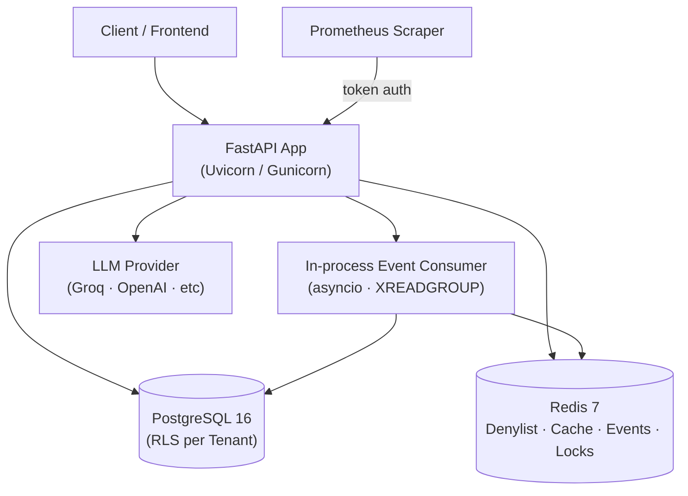
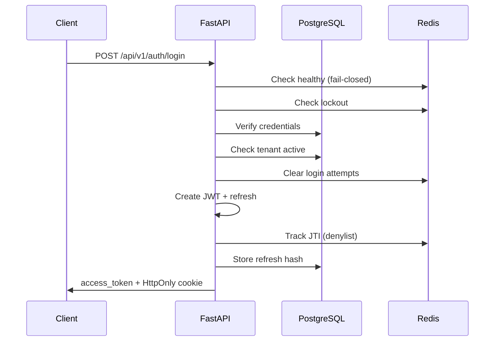
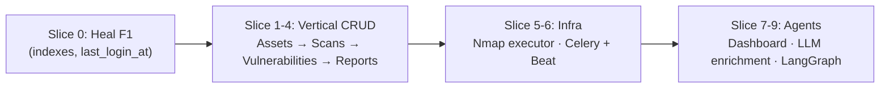

# SOC360-PyMEs — SOC as a Service for Small & Medium Businesses

[🇪🇸 Español](README.es.md)


---

## Why SOC360-PyMEs

Small and medium-sized businesses (PyMEs) face the same cyber threats as enterprises but rarely have the budget to build or maintain a 24/7 Security Operations Center (SOC). **SOC360-PyMEs** closes that gap by delivering a multi-tenant SaaS backend that provides enterprise-grade security operations at a fraction of the cost.

- **Problem**: PyMEs lack dedicated security teams, vulnerability management, and real-time threat detection.
- **Solution**: A SOC-as-a-Service platform with automated asset discovery, AI-powered vulnerability analysis, tenant isolation, and scalable event processing.

---

## Current Status

| Phase | Status | Description |
|-------|--------|-------------|
| **F0** | ✅ Complete | Architecture & Data Model — 23 ADRs, 13 DB tables, security model |
| **F1** | ✅ Complete | Backend Base — Auth, tenants, users, RLS, events, LLM, fail-closed Redis, metrics, outage handling — 1151 tests passing |
| **F2** | 🔄 In Progress | Vulnerability stack — vertical CRUD slices (Assets → Scans → Vulnerabilities → Reports), then Nmap/Celery/Dashboard/LLM agents (PRD v2) |
| **F3** | 📋 Planned | Real-time — WebSockets, log ingestion, anomaly detection |
| **F4** | 📋 Planned | Frontend — React 18 + TypeScript + Vite (MVP June 2026) |
| **F5** | 📋 Planned | Extra Agents — Compliance, Intelligence |
| **F6** | 📋 Planned | Advanced — Email, PDF reports, Redis TLS |
| **F7** | 📋 Planned | QA + Prod — E2E tests, CI/CD, deploy |

---

## Core Features

| Feature | Description |
|---------|-------------|
| **Authentication & Security** | JWT access (15min) + refresh rotation (7d, HttpOnly cookie). JTI denylist via Redis. Login lockout (10 attempts / 15min). Rate limiting. CSRF protection. Security headers. PII sanitization. Fail-closed on Redis outages (auth, revocation, DLQ). |
| **Multi-Tenant (RLS)** | Row-Level Security via PostgreSQL `SET LOCAL`. Transaction-scoped tenant context. 4 plans: Free (10 assets), Starter (25), Pro (100), Enterprise (500). Composite FKs enforce tenant-scoped references (scans → assets). |
| **RBAC** | Hierarchical roles: viewer < analyst/ingestor < admin < superadmin. CHECK constraints enforce tenant rules. Self-protection prevents privilege escalation. |
| **Event Bus** | Redis Streams with typed Pydantic events, consumer groups, XACK, Dead Letter Queue with durable ack, auto-reconnect, blocking reads (XREADGROUP), and lag monitoring. In-process async consumer — no external worker dependency. |
| **LLM Abstraction** | Provider Protocol with 9 providers (Groq, OpenAI, Anthropic, Gemini, Mistral, Cohere, Together, HuggingFace, Ollama). Groq (llama-3.3-70b) default. Singleton caching. `llm_safe_complete()` never raises. Credential redaction. Prompt-injection sanitization for scan data. |
| **Observability** | Multiprocess-safe Prometheus registry (`prometheus-client`). Token-authenticated `/metrics` endpoint. `child_exit` gunicorn hook for worker cleanup. Typed outage catalog (25 FlowIds) mapping failures to sanitized 503 responses with `Retry-After`. |
| **Resilience** | Distributed locks (Redis) with retry/backoff and outage isolation. Startup Redis retry. DB index auto-recovery via `CREATE INDEX CONCURRENTLY`. Toxiproxy fault-injection test harness (revocation, scan-lock, rate-limit faults). |

---

## High-Level Architecture


```mermaid
graph TB
    Client["Client / Frontend"] --> API["FastAPI App<br/>(Uvicorn / Gunicorn)"]
    API --> PG[("PostgreSQL 16<br/>(RLS per Tenant)")]
    API --> Redis[("Redis 7<br/>Denylist · Cache · Events · Locks")]
    API --> Consumer["In-process Event Consumer<br/>(asyncio · XREADGROUP)"]
    Consumer --> Redis
    Consumer --> PG
    API --> LLM["LLM Provider<br/>(Groq · OpenAI · etc)"]
    Scraper["Prometheus Scraper"] -->|token auth| API
```

The platform follows a modular monolith pattern. FastAPI handles HTTP traffic, PostgreSQL enforces tenant isolation at the row level, and Redis serves as the central nervous system for session denylisting, caching, distributed locks, and asynchronous event streaming. Events are consumed by an in-process asyncio task with blocking reads — no external Celery worker is required today (Celery is planned for F2 slices 5–6, alongside the Nmap executor).

---

## Tech Stack

| Technology | Version |
|------------|---------|
| Python | 3.12+ |
| FastAPI | 0.115.6 |
| SQLAlchemy | 2.0.36 |
| asyncpg | 0.30.0 |
| PostgreSQL | 16 (Alpine) |
| Redis | 7 (Alpine, client 5.2.1) |
| Alembic | 1.14.0 |
| Celery | 5.4.0 (planned for F2 slices 5–6) |
| Uvicorn | 0.32.1 |
| Gunicorn | — (prod, `gunicorn_conf.py`) |
| Pydantic | 2.10.4 |
| pydantic-settings | 2.7.0 |
| PyJWT[crypto] | >=2.8,<3 |
| bcrypt | >=4.0 |
| prometheus-client | >=0.26.0 |
| structlog | 24.4.0 |
| pytest | 8.3.4 |
| pytest-asyncio | 0.24.0 |
| ruff | 0.8.4 |
| mypy | 1.13.0 |
| httpx | 0.27.2 |
| fakeredis | 2.34.1 |
| Docker Compose | — |
| Groq (llama-3.3-70b) | LLM default |

---

## Project Structure

```
soc360-pymes/
├── app/
│   ├── main.py                 # FastAPI entrypoint, lifespan, routers, /metrics, /health
│   ├── dependencies/           # FastAPI deps (get_db, get_current_user, locks, LLM, cross-tenant)
│   ├── event_bus/              # Redis Streams EventBus + consumer + DLQ
│   ├── event_schemas.py        # Pydantic event schemas
│   ├── agents/                 # F2 agents (planned)
│   ├── core/                   # Shared layer
│   │   ├── config.py           # pydantic-settings
│   │   ├── database.py         # SQLAlchemy async engine, RLS helper
│   │   ├── security.py         # JWT, bcrypt, denylist, JTI, roles
│   │   ├── redis.py            # Redis pool + health check + startup retry
│   │   ├── middleware.py       # SecurityHeaders + HTTPS redirect
│   │   ├── exceptions.py       # Error hierarchy (RedisOutageError, TemporaryUnavailableError)
│   │   ├── logging.py          # structlog + redaction
│   │   ├── llm/                # Multi-provider LLM abstraction (config, factory, providers)
│   │   ├── contracts.py        # TypedDict contracts
│   │   ├── pii.py              # PII sanitization
│   │   ├── types.py            # Custom types
│   │   ├── metrics.py          # Multiprocess Prometheus registry
│   │   ├── metrics_auth.py     # /metrics token auth
│   │   ├── outage.py           # Typed outage catalog (25 FlowIds)
│   │   ├── rate_limit.py       # Redis rate limiting
│   │   └── dist_lock.py        # Distributed locks
│   └── modules/                # Domain modules
│       ├── auth/               # ✅ F1 — 984 loc
│       ├── tenants/            # ✅ F1 — 532 loc
│       ├── users/              # ✅ F1 — 620 loc
│       ├── assets/             # ✅ F2 — models (57 loc)
│       ├── scans/              # ✅ F2 — models (82 loc)
│       ├── vulnerabilities/    # ✅ F2 — models (80 loc)
│       └── reports/            # ✅ F2 — models (80 loc)
├── tests/                      # 1,151 tests
│   ├── conftest.py             # Shared fixtures
│   ├── unit/                   # Fakeredis + mocks
│   ├── integration/            # Real DB + Alembic + Toxiproxy fault injection
│   ├── api/                    # httpx AsyncClient
│   ├── modules/                # Module-level tests
│   ├── sdd/                    # RLS / index / migration constraint tests
│   └── helpers/                # broken_redis, toxiproxy harnesses
├── migrations/                 # 7 Alembic migrations
├── docker/                     # Docker volumes
├── scripts/
│   └── seed_db.py              # Idempotent seed
├── docker-compose.yml
├── Dockerfile
├── entrypoint.sh
├── gunicorn_conf.py
├── pytest.ini
├── .env.example
└── AGENTS.md
```

> **Note**: Assets, Scans, and Vulnerabilities modules have models implemented (F2 in progress — CRUD slices per PRD v2). Empty scaffold modules (dashboard, alerts, anomalies, ingest) have been removed.

---

## Quickstart

**Prerequisites**: Docker, Python 3.12+, [uv](https://docs.astral.sh/uv/getting-started/installation/)

### With uv (recommended)

```bash
# 1. Clone
git clone https://github.com/Dani1lopez/soc360-pymes.git
cd soc360-pymes

# 2. Sync dependencies (creates .venv automatically)
uv sync --extra dev

# 3. Configure environment
cp .env.example .env
# Edit .env if needed (Docker exposes PostgreSQL on port 5433)

# 4. Start services (PostgreSQL 16 + Redis 7)
docker compose --profile dev up -d

# 5. Wait for services to be healthy, then migrate
uv run alembic upgrade head

# 6. Seed database with demo data
uv run python scripts/seed_db.py

# 7. Run tests (1,151 tests across 5 layers)
uv run pytest -v

# 8. Start dev server
uv run uvicorn app.main:app --reload

# 9. Verify it works
curl http://localhost:8000/health
```

---

## Development Workflow

1. **Branch**: Create feature branches from `main`.
2. **Commits**: Use [Conventional Commits](https://www.conventionalcommits.org/) (`feat:`, `fix:`, `docs:`, `test:`, `refactor:`).
3. **Pull Requests**: Open PRs against `main`. CI (GitHub Actions) runs tests, ruff, mypy, and lockfile freshness checks.
4. **Merge**: PRs are squash-merged to keep `main` history linear and readable.

---

## Testing & Quality

The test suite is organized in five layers:

| Layer | Scope | Command |
|-------|-------|---------|
| **Unit** | Fakeredis + mocks, no DB | `pytest tests/unit -v` |
| **Integration** | Real PostgreSQL + Alembic migrations + Toxiproxy fault injection | `pytest tests/integration -v` |
| **API** | Full HTTP cycle via `httpx.AsyncClient` | `pytest tests/api tests/test_auth.py tests/test_tenants.py tests/test_users.py -v` |
| **Modules** | Module-scoped behavior (auth session caps, refresh-token races) | `pytest tests/modules -v` |
| **SDD** | RLS cross-tenant, index health, migration constraints | `pytest tests/sdd -v` |

Additional quality commands:

```bash
# Linting
uv run ruff check .
uv run ruff format .

# Type checking
uv run mypy .

# Full suite
uv run pytest -v
```

Key testing patterns:
- Concurrency tests for advisory locks and parallel sessions.
- Fail-closed tests for Redis-down scenarios (auth, revocation, locks, DLQ).
- Toxiproxy fault-injection matrix: revocation events, scan locks, rate-limit, DB statement timeout.
- Deterministic seeding with fixed UUIDs, 2 tenants, and 5 users.

---

## API Overview

The following endpoints are currently available:

| Method | Path | Description |
|--------|------|-------------|
| `POST` | `/api/v1/auth/login` | Authenticate and receive JWT + refresh cookie |
| `POST` | `/api/v1/auth/refresh` | Rotate refresh token (HttpOnly cookie required) |
| `POST` | `/api/v1/auth/logout` | Revoke current session |
| `POST` | `/api/v1/auth/change-password` | Change password and cascade revocation |
| `GET` | `/api/v1/users/me` | Get current user profile |
| `POST` | `/api/v1/users/` | Create user (admin+) |
| `GET` | `/api/v1/users/` | List users (tenant-scoped) |
| `GET` | `/api/v1/users/{id}` | Get user by ID |
| `PATCH` | `/api/v1/users/{id}` | Update user |
| `DELETE` | `/api/v1/users/{id}` | Deactivate user (self-protected) |
| `POST` | `/api/v1/tenants/` | Create tenant (superadmin) |
| `GET` | `/api/v1/tenants/` | List tenants (superadmin) |
| `GET` | `/api/v1/tenants/{id}` | Get tenant by ID |
| `PATCH` | `/api/v1/tenants/{id}` | Update tenant |
| `DELETE` | `/api/v1/tenants/{id}` | Deactivate tenant |
| `GET` | `/health` | Liveness probe (status + version) |
| `GET` | `/health/db/indexes` | Invalid DB index probe (k8s target) |
| `GET` | `/metrics` | Prometheus scrape endpoint (token-authenticated, not in schema) |

Full OpenAPI documentation is available at `/api/docs` when the server is running (disabled in production).

---

## Auth Flow


```mermaid
sequenceDiagram
    participant C as Client
    participant API as FastAPI
    participant DB as PostgreSQL
    participant R as Redis

    C->>API: POST /api/v1/auth/login
    API->>R: Check healthy (fail-closed)
    API->>R: Check lockout
    API->>DB: Verify credentials
    API->>DB: Check tenant active
    API->>R: Clear login attempts
    API->>API: Create JWT + refresh
    API->>R: Track JTI (denylist)
    API->>DB: Store refresh hash
    API->>C: access_token + HttpOnly cookie
```

---

## F2 Pipeline (In Progress — PRD v2)


```mermaid
graph LR
    A["Slice 0: Heal F1<br/>(indexes, last_login_at)"] --> B["Slice 1-4: Vertical CRUD<br/>Assets → Scans → Vulnerabilities → Reports"]
    B --> C["Slice 5-6: Infra<br/>Nmap executor · Celery + Beat"]
    C --> D["Slice 7-9: Agents<br/>Dashboard · LLM enrichment · LangGraph"]
```

F2 follows [PRD v2](openspec/changes/prd-v2-vertical-f2/) ("build vertical, clean first"). Each module (Assets, Scans, Vulnerabilities, Reports) gets Pydantic schemas, async tenant-scoped services, RBAC routers, and tests before moving to infrastructure (safe Nmap execution, Celery workers) and agents (dashboard metrics, 8-task LLM enrichment pipeline, LangGraph agent pipeline). Models and migrations for all four modules are already implemented with composite FKs for tenant isolation.

---

## Roadmap

| Phase | Focus | Status |
|-------|-------|--------|
| F0 | Architecture & Data Model | ✅ Complete |
| F1 | Backend Base (Auth, Tenants, Users, RLS, Events, LLM, Metrics, Outages) | ✅ Complete |
| F2 | Vulnerability stack — vertical CRUD + infra/agents (PRD v2) | 🔄 In Progress |
| F3 | Real-time (WebSockets, Ingestion, Anomalies) | 📋 Planned |
| F4 | Frontend (React 18 + TS + Vite) | 📋 Planned |
| F5 | Extra Agents (Compliance, Intelligence) | 📋 Planned |
| F6 | Advanced (Email, PDF reports, Redis TLS) | 📋 Planned |
| F7 | QA + Prod (E2E, CI/CD polish, Deploy) | 📋 Planned |

> The active delivery plan is [PRD v2 — F2 Vertical Build](openspec/changes/prd-v2-vertical-f2/), which supersedes the archived [PRD v1 MVP June](openspec/changes/archive/2026-06-28-prd-v1-mvp-junio/).

---

## Contributing

Contributions are welcome. Please open an issue to discuss significant changes before submitting a PR. For bug fixes and small improvements, feel free to open a PR directly.

- [Open an issue](https://github.com/Dani1lopez/soc360-pymes/issues)
- [Submit a PR](https://github.com/Dani1lopez/soc360-pymes/pulls)

---

## License

This project is **open source** under the [MIT License](LICENSE).

```
MIT License — Copyright (c) 2026 Daniel Alcaraz López
Permission is hereby granted, free of charge, to any person obtaining a copy
of this software and associated documentation files (the "Software"), to deal
in the Software without restriction, including without limitation the rights
to use, copy, modify, merge, publish, distribute, sublicense, and/or sell
copies of the Software, and to permit persons to whom the Software is
furnished to do so, subject to the following conditions:

The above copyright notice and this permission notice shall be included in all
copies or substantial portions of the Software.

THE SOFTWARE IS PROVIDED "AS IS", WITHOUT WARRANTY OF ANY KIND, EXPRESS OR
IMPLIED, INCLUDING BUT NOT LIMITED TO THE WARRANTIES OF MERCHANTABILITY,
FITNESS FOR A PARTICULAR PURPOSE AND NONINFRINGEMENT.
```

See the full license text in [`LICENSE`](LICENSE).
