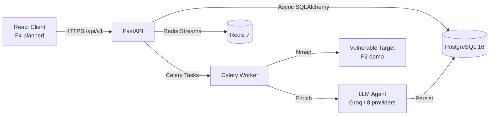
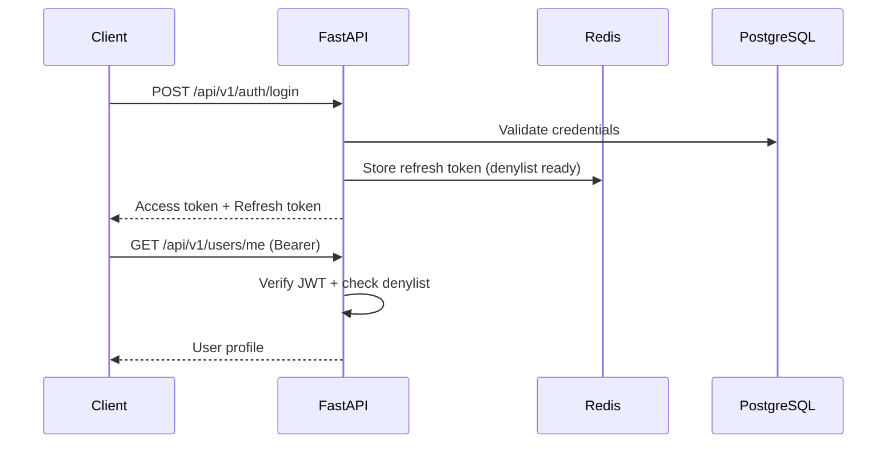
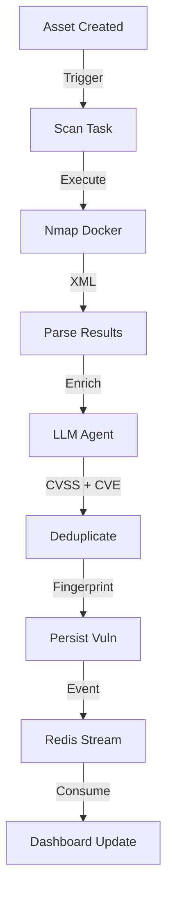

# Design: Bilingual README for SOC360-PyMEs

## Technical Approach

Create two root-level Markdown documents — `README.md` (English, canonical) and `README.es.md` (Spanish, mirror) — that serve as the public GitHub entry point. Both files are static documentation; no build step or runtime code is required. The design focuses on content strategy, structural parity, visual identity, and maintainability so that future updates remain synchronized with minimal overhead.

## Architecture Decisions

| Decision | Alternatives | Rationale |
|----------|--------------|-----------|
| Two separate files (`README.md` + `README.es.md`) | Single file with i18n sections | GitHub renders only one file per view; separate files provide clean URLs, independent anchor navigation, and simpler contribution workflow. |
| English as canonical (`README.md`) | Spanish as canonical | Matches GitHub global convention; English README is the default landing page for international contributors and recruiters. |
| Mermaid diagrams (GitHub-native) | ASCII art or external images | Mermaid renders natively on GitHub since 2022; no external hosting, stays version-controlled, and updates with code changes. |
| shields.io badges (SVG) | GitHub-native badges or plain text | shields.io is the de-facto standard; SVG scales, caches via CDN, and supports dynamic data if we wire CI later. |
| Code blocks with explicit language tags | Plain text blocks | Syntax highlighting improves readability; consistent with the spec (REQ-RDM-004). |
| Emoji indicators for roadmap only | Emojis everywhere | Minimal emoji usage keeps a senior/professional tone; emojis are restricted to the roadmap status column per spec (REQ-RDM-001). |
| No table of contents generator | Auto-generated TOC | GitHub already generates an outline from headings; a manual TOC at the top adds a discoverable nav layer for long documents without extra tooling. |

## Content Strategy

### Tone & Voice
- **Persona**: Senior backend architect writing to peers — CTOs, security engineers, and experienced Python developers evaluating the repo.
- **Attributes**: Precise, warm, confident. No hype, no buzzwords. Show, don't tell.
- **Language level**: C1+ English, natural Rioplatense Spanish (warm, professional, avoiding anglicisms where a precise Spanish equivalent exists).

### Narrative Arc
1. **Hook**: What problem does SOC360-PyMEs solve? (PyMEs can't afford enterprise SOCs.)
2. **Proof**: What exists today? (F1 complete, 311 unit tests, clean architecture.)
3. **Promise**: Where is it going? (F2–F7 roadmap, June MVP.)
4. **Action**: How do I run it locally in <10 minutes?

### Differentiator
The README must communicate three unique signals:
- **Multi-tenant security by design** from day one (RLS, JWT denylist, CSRF).
- **LLM abstraction with 9 providers** (not just OpenAI) — real protocol-based architecture, not a hardcoded client.
- **Event-driven async core** (Redis Streams, not just a cache layer) feeding a LangGraph agent pipeline for vulnerability enrichment.

## Structure Blueprint

### README.md (English — canonical)

| # | Section | Purpose | Min Content | Visual Elements | Tone |
|---|---------|---------|-------------|-----------------|------|
| 1 | Hero | 3-second comprehension | H1 title + one-line value prop + repo URL | None | Punchy |
| 2 | Badges | Instant credibility | Python 3.12+, FastAPI, PostgreSQL 16, Redis 7, MIT License, Tests passing | 6 shields.io badges | Factual |
| 3 | Language Switcher | Bidirectional navigation | Link to `README.es.md` with emoji flag | Inline link | Neutral |
| 4 | TOC | Navigate long doc | Anchor links to all H2 sections | Bullet list | Neutral |
| 5 | Why SOC360-PyMEs | Problem → solution narrative | 2 paragraphs: PyME gap + our approach | None | Warm, persuasive |
| 6 | Current Status | Honest snapshot of progress | F1 ✅, F2 🔄, F3–F7 📋 with 1-line description per phase | Table with emoji status | Transparent |
| 7 | Core Features | What the backend does today | Bulleted list: auth, tenants, RLS, LLM abstraction, event bus | None | Descriptive |
| 8 | Architecture | High-level data flow | Mermaid diagram: Client → FastAPI → PostgreSQL / Redis / Celery / LangGraph Agent | Mermaid code block | Technical |
| 9 | Tech Stack | Inventory of dependencies | Table: category, technology, version | Markdown table | Factual |
| 10 | Project Structure | Orient new developers | Tree output of `app/` and `tests/` | Code block (tree) | Neutral |
| 11 | Quickstart | Clone → tests in <10 min | Step-by-step commands (clone, env, docker, venv, deps, migrations, seed, tests, run) | Code blocks with `bash` tag | Actionable |
| 12 | Development Workflow | How we work | Branch naming, PR process, test commands | None | Instructive |
| 13 | Testing & Quality | Quality signals | Unit vs integration split, markers, coverage guidance | Code blocks | Reassuring |
| 14 | Roadmap | Future direction | F2–F7 phases with target dates (June MVP) | Table with status emojis | Aspirational |
| 15 | Contributing | Lower barrier to PR | Link to `CONTRIBUTING.md` (or placeholder) + code of conduct note | None | Welcoming |
| 16 | License | Legal clarity | MIT License statement + link to `LICENSE` | None | Factual |

### README.es.md (Spanish — mirror)

- **Identical section count and order** as `README.md`.
- **Professional Spanish**: no machine-translation artifacts. Technical terms preserved in English when no consensus Spanish equivalent exists (e.g., "JWT denylist", "Redis Streams", "LLM provider").
- **Byte-identical**: all shields.io URLs, all CLI commands, all version numbers, all Mermaid diagrams.
- **Cross-link**: `📖 [Read this in English](README.md)` at the top.

## Diagrams

### 1. High-Level Architecture (Mermaid)



### 2. Auth Flow (Mermaid)



### 3. F2 Scan Pipeline (Mermaid)



## Badges Strategy

| Badge | shields.io URL | Category |
|-------|----------------|----------|
| Python 3.12+ | `https://img.shields.io/badge/python-3.12%2B-blue?logo=python&logoColor=white` | Stack |
| FastAPI | `https://img.shields.io/badge/FastAPI-0.115.6-009688?logo=fastapi` | Stack |
| PostgreSQL 16 | `https://img.shields.io/badge/PostgreSQL-16-4169E1?logo=postgresql` | Stack |
| Redis 7 | `https://img.shields.io/badge/Redis-7-DC382D?logo=redis` | Stack |
| Tests | `https://img.shields.io/badge/tests-311%20passed-brightgreen?logo=pytest` (static for now) | Quality |
| License MIT | `https://img.shields.io/badge/license-MIT-yellow` | Community |

**Note**: The tests badge is static (311 passed) until CI is wired (F7). If the user prefers to show the historical "97/97" for F1 integration tests, a second badge `integration 97/97` can be added, but the design recommends showing the current unit test count (311) to reflect the real state.

## Quickstart Design

### Prerequisites
- Docker + Docker Compose
- Python 3.12+
- git

### Steps (verified commands)

| Step | Command | Time | Failure Mode & Fix |
|------|---------|------|-------------------|
| 1. Clone | `git clone https://github.com/Dani1lopez/soc360-pymes.git && cd soc360-pymes` | 15s | Auth error → use SSH or check network |
| 2. Env file | `cp .env.example .env` | 2s | None |
| 3. Start infra | `docker compose --profile dev up -d` | 30s | Port 5433/6379 in use → stop local Postgres/Redis or edit `.env` |
| 4. Create venv | `python3.12 -m venv .venv && source .venv/bin/activate` | 10s | `python3.12` not found → use `python3` or install 3.12 |
| 5. Install deps | `pip install -r requirements.txt -r requirements-dev.txt` | 45s | Network timeout → retry or use mirror |
| 6. Run migrations | `alembic upgrade head` | 5s | DB not ready → wait 10s and retry |
| 7. Seed data | `python -m scripts.seed` (if exists) or note that seeds run via migration | 5s | Skip if not present |
| 8. Run unit tests | `pytest tests/unit -q` | 20s | All should pass (311) |
| 9. Run integration tests | `pytest tests/integration -q` | 60s | Requires Docker running; 84 tests |
| 10. Start server | `uvicorn app.main:app --reload --port 8000` | 5s | Port 8000 in use → change port |
| 11. Health check | `curl http://localhost:8000/health` | 2s | Should return `{"status":"ok","version":"0.1.0"}` |

**Total estimated time**: 6–8 minutes on a modern machine with good network.

**No external API keys required for basic setup**: Groq key is optional; unit tests mock all LLM calls.

## Cross-Language Strategy

- **Placement**: Language switcher is the third element in both files (after hero + badges).
- **Visibility**: Use a centered line with both flags and links: `🇺🇸 [English](README.md) | 🇪🇸 [Español](README.es.md)`.
- **Consistency enforcement**: A simple shell script (`scripts/check_readme_parity.sh`) will be designed in tasks that:
  - Counts `^##` headings in both files and asserts equality.
  - Extracts shields.io badge URLs and asserts byte-identical sets.
  - Verifies that code blocks (` ```bash `) are identical.

## Visual Identity

- **Color palette**: Inherit from shields.io badges only. No custom CSS or HTML.
- **Code blocks**: Use ` ```bash ` for shell, ` ```python ` for Python, ` ```mermaid ` for diagrams, ` ```text ` for trees.
- **Emojis**: Restricted to roadmap status column and language switcher flags. No decorative emojis in headings or body text.
- **Typography**: GitHub default (system-ui stack). No custom fonts.

## Maintenance Guidelines

- **Sync trigger**: Update both READMEs whenever:
  - A new feature lands (change status emoji in roadmap).
  - A dependency version changes (update tech stack table).
  - A new module is added (update project structure tree).
  - Test count changes significantly (update badge).
- **Frequency**: At minimum, review both files at the end of each phase (F2, F3, etc.).
- **CI validation** (future, F7):
  - Markdown linter (`markdownlint-cli2`).
  - Link checker (`lychee`).
  - Parity checker script (`scripts/check_readme_parity.sh`).

## File Changes

| File | Action | Description |
|------|--------|-------------|
| `README.md` | Create | English canonical README |
| `README.es.md` | Create | Spanish mirror README |
| `scripts/check_readme_parity.sh` | Create | Structural parity validator (headings, badges, code blocks) |

## Testing Strategy

| Layer | What to Test | Approach |
|-------|-------------|----------|
| Markdown validity | Both files render without errors on GitHub | Preview on GitHub branch; `markdownlint-cli2` locally |
| Link integrity | All internal anchors and external URLs return 200 | `lychee README.md README.es.md` |
| Structural parity | Same heading count, same badge URLs, same commands | `scripts/check_readme_parity.sh` |
| Quickstart accuracy | Commands produce expected outcomes | Manual run-through on fresh clone |

## Migration / Rollout

No migration required. These are new documentation files with no impact on existing code or data.

## Open Questions

- [ ] Should the tests badge show 311 (unit) or 97 (integration/F1 historical)? Decision: show 311 unit + note integration count in text.
- [ ] Is `scripts/seed.py` available? If not, skip step 7 in Quickstart or replace with migration note.
- [ ] Should we add a `CONTRIBUTING.md` placeholder now or defer to F7? Decision: add a brief Contributing section inline; link to a future `CONTRIBUTING.md`.
